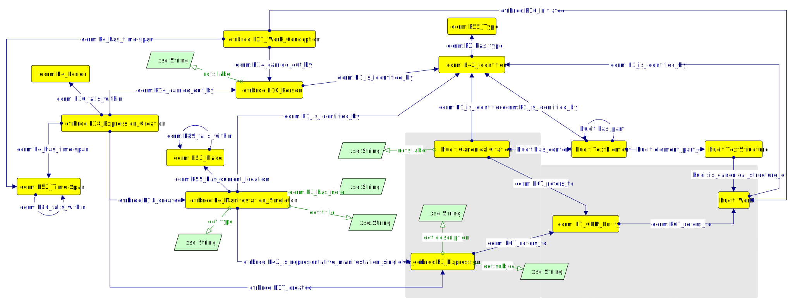
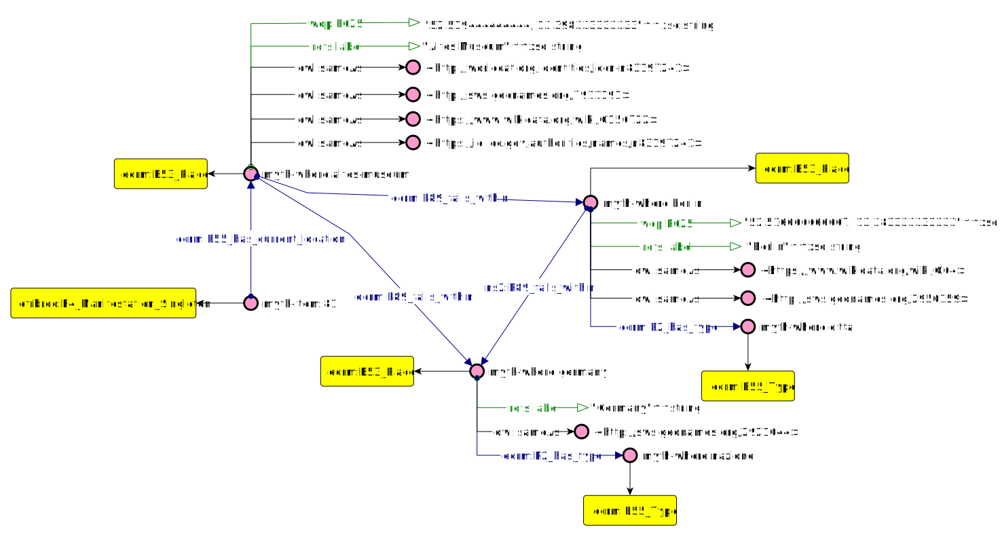
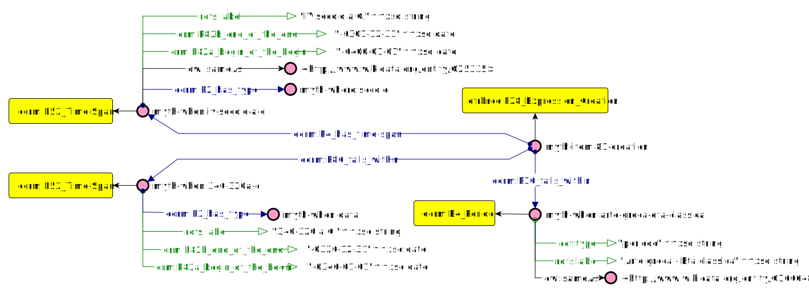

# Mythologiae Datamodel 

## Layered Approach

(4 livelli blabliablia) + img 

The figure below representslayers 0 and 1 of the datamodel (based on mima + paper JLIS). In particular, all class and properties in the gray zone represent the assertion graph (layer 1) and all the other class and properties in white background represent factual data (layer 0).

  

For the sake of simplicity, Mythologiae Datamodel has been tested in modules. Those modules are named 'What', 'Where', 'When', 'Where' - the four dimensions created by the reuse of an event-centric backbone ontology (FRBRoo). It is worth to underline that this research main interest is to investigate the 'What' dimension, taking into consideration how it interacts with the other three modules. 
In particular, the 'What' dimension represents how citations mentioning works and items are linked together through the use of conceptual categories. 'When', 'Where' and 'Who' can be seen as three modules of addition information aiming to investigate in toto the 'What' dimension. 

Approach to datamodelling activity:
* Design of the domain
* input csv cleaning into computable python format to generate rdf
* Competency questions for each of the modules (WHAT, WHERE, WHO, WHEN) and submodules (WHAT: items, works, citations, conceptual categories)
* refactorization of concepts in triple-fashion using existing ontologies
* data alignement with external sources (e.g. Perseus, VIAF)
* conversion of input csv in python format into rdf (with rdf lib) following the chosen ontologies structures
* manual checking of entities (e.g. URIs consistency, doubles elimination)
* perfomation of queries to find errors in data production (e.g. missing properties between individuals)
* performation of CQs to test datamodel and dataset representational requirements
* again, automatic, semiautomatic and manual adjustment of data

This process has been performed sequentially and on each module and submodule.

## Layers 0 and 1 

### WHAT
#### Items
Items have been modelled with FRBRoo and dcterms. 
Example: The figure below expresses the the item 775 and its metadata, along with its conceptual aspect which represents Teseus.    

URIs identifying items (efrbroo:F4_Manifestation_Singleton) are are incrementally numbered. 

#### Citations
Citations (Canonical Citations) has been modelled through the use of hucit.  

Example in natural language: "The passage "Eneide, IV, 362-392" refers to the abandon of Dido By Eneas". 

URIs identifying citations (hucit:Citation) are incrementally numbered. URIs identifying textual elements of the canonical work (hucit:TextElement) follow the structure "book number, line-line". URIs identifying works (hucit:Work) follows the strucuture "author name, work name" reconciled against viaf when possible.  

#### Works
Works have been modelled with FRBRoo. 
Example in natural language: "In "Rime" by Francesco Petrarca is take up the figure oF Arianna, princess of Cnosso"

URIs identifying works (hucit:Work) follows the strucuture "author name, work name" reconciled against viaf when possible.  
Reconliciation against VIAF, why is this so important? 
Considering the messy data input, most of the cited works has been slightly differently recorded as strings in the input csv (e.g. Boccaccio Giovanni --> "Della Genealogia degli dei" oppure "Genalogie Deorum Gentilium Libri" oppure "Genalogie Deorum Gentilium" oppure "Genalogie Deorum"). VIAF reconciliation guarantees to reconduct all this different forms of the same work to a single controlled label (e.g. "Boccaccio, Giovanni, 1313-1375. | Genealogia deorum") and identifier (e.g. 182235138). The controlled label has been reused to create the rdf-dataset internal corresponding URIs (e.g. myth-work:boccaccio-giovanni-genealogie-deorum).

#### Conceptual Categories

(....)

### WHERE 

Example in natural language: "Item 81 is currently stored in Altes Museum (Berlin, Germany)". 

### WHEN 
Example in natural language: "Item 81 has been created between 320 and 340 b.C. (IV century b.C.) and belongs to the Classical era - Greek art".

### WHO 

(...)
