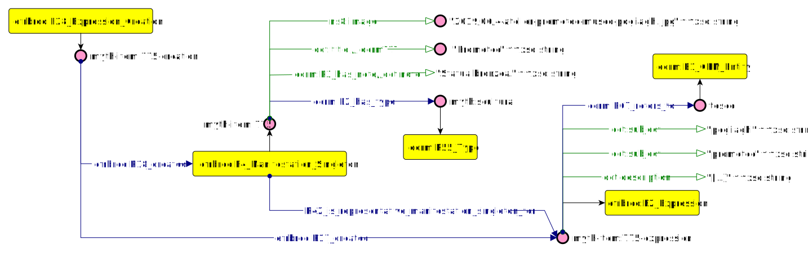
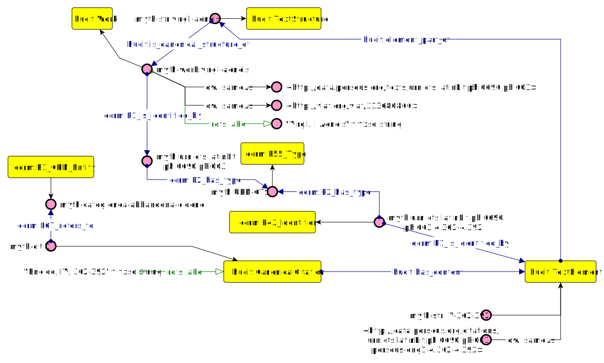
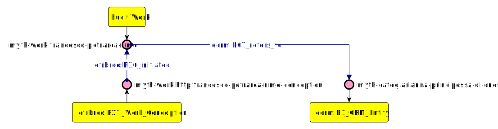

# Mythologiae Datamodel 

[img]

Considering the first and second layer of the datamodel (based on mima + paper JLIS)
For the sake of simplicity, Mythologiae Datamodel has been tested in modules. Those modules are named 'What', 'Where', 'When', 'Where' - the four dimensions created by the reuse of an event-centric backbone ontology (FRBRoo). It is worth to underline that this research main interest is to investigate the 'What' dimension, taking into consideration how it interacts with the other three modules. 
In particular, the 'What' dimension represents how citations mentioning works and items are linked together through the use of conceptual categories. 'When', 'Where' and 'Who' can be seen 
as three modules of addition information aiming to investigate in toto the 'What' dimension. 

# WHAT
## Items
Items have been modelled with FRBRoo and dcterms. 
Example: The figure below expresses the the item 775 and its metadata, along with its conceptual aspect which represents Teseus.    

URIs identifying items (efrbroo:F4_Manifestation_Singleton) are are incrementally numbered. 

## Citations
Citations (Canonical Citations) has been modelled through the use of hucit.  

Example in natural language: "The passage "Eneide, IV, 362-392" refers to the abandon of Dido By Eneas". 

URIs identifying citations (hucit:Citation) are incrementally numbered. URIs identifying textual elements of the canonical work (hucit:TextElement) follow the structure "book number, line-line". URIs identifying works (hucit:Work) follows the strucuture "author name, work name" reconciled against viaf when possible.  

## Works
Works have been modelled with FRBRoo. 
Example in natural language: "In "Rime" by Francesco Petrarca is take up the figure oF Arianna, princess of Cnosso"

URIs identifying works (hucit:Work) follows the strucuture "author name, work name" reconciled against viaf when possible.  

## Conceptual Categories

