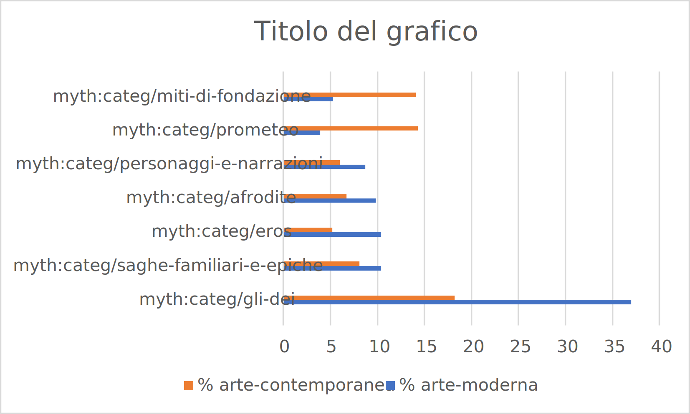

# Queries on timing (when module)

### CQ1: A quali periodi storici appartengono gli item che rappresentano Didone?

 ```
SELECT (COUNT(DISTINCT ?item) AS ?n_items) ?period
WHERE {
    graph ?assertion {?item_expr ecrm:P67_refers_to <http://example.org/categ/didone>}
    graph myth:factual_data { 
      ?creation efrbroo:R18_created ?item ;
               efrbroo:R18_created ?item_expr;
                ecrm:P10_falls_within ?period.
    ?item a efrbroo:F4_Manifestation_Singleton .
    ?period dct:type "periodo"
  }}
GROUP BY ?period ORDER BY DESC (?n_items)
 ```
### CQ2: A quale periodo appartengono gli item la cui categoria è citata nelle Eneide?
 ```
SELECT (COUNT(DISTINCT ?item) AS ?n_items) ?period
WHERE { 
  graph ?assertion {?item_expr ecrm:P67_refers_to ?categ. 
  <http://purl.org/hucit/kb/works/1413> ecrm:P67_refers_to ?categ . 
   graph myth:factual_data { 
      ?creation efrbroo:R18_created ?item ;
               efrbroo:R18_created ?item_expr;
                ecrm:P10_falls_within ?period.
    ?item a efrbroo:F4_Manifestation_Singleton .
    ?period dct:type "periodo".
  }}

GROUP BY ?period ORDER BY DESC (?n_items)
 ```
CQ3: Quanti item sono stati creati in ogni periodo?

CQ4: Qual è la categoria più rappresentata in ogni periodo? 


CHECK PER LE DATE: quali sono gli item la cui creazione è posteriore al 1300?
 ```
SELECT DISTINCT ?item
WHERE {

  graph myth:factual_data { 
    ?item_expr a efrbroo:F2_Expression. 
    ?item a efrbroo:F4_Manifestation_Singleton .
    ?creation efrbroo:R18_created ?item_expr ;
              efrbroo:R18_created ?item ; 
    			ecrm:P10_falls_within  ?timeSpan. 
    ?timeSpan ecrm:P82a_begin_of_the_begin ?date 
  }


  FILTER( ?date >= xsd:date("1300-01-01"))
}
 ```
 
 CHECK PER LE DATE: quali sono gli item la cui creazione è anteriore al 10 a.C.? 
 ```
SELECT DISTINCT ?item ?date
WHERE {

  graph myth:factual_data { 
    ?item_expr a efrbroo:F2_Expression. 
    ?item a efrbroo:F4_Manifestation_Singleton .
    ?creation efrbroo:R18_created ?item_expr ;
              efrbroo:R18_created ?item ; 
    			ecrm:P10_falls_within  ?timeSpan. 
    ?timeSpan ecrm:P82a_begin_of_the_begin ?date }

  FILTER( ?date < xsd:date("-0010-01-01"))
}
 ```


## Approfondimento ed analisi sui dati per il modulo WHEN

4311 Items appartengono ad un periodo
4345 sono gli item totali nel dataset 
34 sono gli item a cui non viene assegnato un periodo  

|   n_items           | period                                 |
|---------------------|----------------------------------------|
| "1936"^^xsd:integer | myth:time/arte-moderna                 |
| "1093"^^xsd:integer | myth:time/arte-contemporanea           |
| "331"^^xsd:integer  | myth:time/arte-greca-eta-classica      |
| "295"^^xsd:integer  | myth:time/arte-romana-eta-imperiale    |
| "233"^^xsd:integer  | myth:time/arte-greca-eta-arcaica       |
| "151"^^xsd:integer  | myth:time/arte-greca-eta-ellenistica   |
| "100"^^xsd:integer  | myth:time/arte-romana                  |
| "78"^^xsd:integer   | myth:time/arte-etrusco-italica         |
| "71"^^xsd:integer   | myth:time/arte-romana-eta-repubblicana |
| "21"^^xsd:integer   | myth:time/arte-medievale               |
| "2"^^xsd:integer    | myth:time/arte-greca-eta-micenea       |

Ci vorrebbe un re-regroup delle categorie con le loro superclassi, così da poter categorizzare: arte contemporanea, arte moderna, arte greca, arte romana, arte etrusca, arte medievale . 

| Sovra-periodo      | N items | % items su tot |
|--------------------|---------|----------------|
| arte moderna:      | 1936    | 44,6           |
| arte contemporanea | 1093    | 25,16          |
| arte greca         | 717     | 16,5           |
| arte romana        | 19,7    | 19,7           |
| arte etrusca       | 1,8     | 1,8            |
| arte medievale     | 0,5     | 0,5            |
| no periodo         | 0,8     | 0,8            |

Il dataset risulta sbilanciato per quanto riguarda i periodi 

CQ5: Quali sono i 5 temi più rappresentati in arte moderna?
 ```
SELECT DISTINCT ?category (COUNT(?item_expr) AS ?n_item_expr)
WHERE {
      graph ?assertion {?item_expr ecrm:P67_refers_to ?category}
  
   graph myth:factual_data { 
    ?creation efrbroo:R18_created ?item_expr; 
			ecrm:P10_falls_within <http://example.org/time/arte-moderna> .
    ?item_expr a efrbroo:F2_Expression}
}

GROUP BY ?category ORDER BY DESC (?n_item_expr)
 ```
| category                            | n_item_expr        |
|-------------------------------------|--------------------|
| myth:categ/gli-dei                  | "716"^^xsd:integer |
| myth:categ/saghe-familiari-e-epiche | "201"^^xsd:integer |
| myth:categ/eros                     | "200"^^xsd:integer |
| myth:categ/afrodite                 | "189"^^xsd:integer |
| myth:categ/personaggi-e-narrazioni  | "168"^^xsd:integer |

CQ6: Quali sono i 5 temi più rappresentati in arte contemporanea?
 ```
SELECT DISTINCT ?category (COUNT(?item_expr) AS ?n_item_expr)
WHERE {
      graph ?assertion {?item_expr ecrm:P67_refers_to ?category}
  
   graph myth:factual_data { 
    ?creation efrbroo:R18_created ?item_expr; 
			ecrm:P10_falls_within <http://example.org/time/arte-contemporanea> .
    ?item_expr a efrbroo:F2_Expression}
}

GROUP BY ?category ORDER BY DESC (?n_item_expr)
 ```
| category                            | n_item_expr        | 
|-------------------------------------|--------------------|
| myth:categ/gli-dei                  | "199"^^xsd:integer |
| myth:categ/prometeo                 | "156"^^xsd:integer |
| myth:categ/miti-di-fondazione       | "154"^^xsd:integer |
| myth:categ/saghe-familiari-e-epiche | "88"^^xsd:integer  |
| myth:categ/afrodite                 | "73"^^xsd:integer  |

Comparando i dati delle due tabelle di CQ5  e CQ6 ...

| category                            | % arte-moderna | % arte-contemporanea |
|-------------------------------------|----------------|----------------------|
| myth:categ/gli-dei                  | 37,0           | 18,2                 |
| myth:categ/saghe-familiari-e-epiche | 10,4           | 8,1                  |
| myth:categ/eros                     | 10,4           | 5,2                  |
| myth:categ/afrodite                 | 9,8            | 6,7                  |
| myth:categ/personaggi-e-narrazioni  | 8,7            | 6,0                  |
| myth:categ/prometeo                 | 3,9            | 14,3                 |
| myth:categ/miti-di-fondazione       | 5,3            | 14,1                 |

Inoltre, consideriamo quante categorie vengono rappresentate raggruppando gli item per periodo di produzione. 

| period                                 | n_categ            |
|----------------------------------------|--------------------|
| myth:time/arte-moderna                 | "119"^^xsd:integer |
| myth:time/arte-contemporanea           | "110"^^xsd:integer |
| myth:time/arte-greca-eta-classica      | "64"^^xsd:integer  |
| myth:time/arte-romana-eta-imperiale    | "61"^^xsd:integer  |
| myth:time/arte-greca-eta-arcaica       | "49"^^xsd:integer  |
| myth:time/arte-greca-eta-ellenistica   | "47"^^xsd:integer  |
| myth:time/arte-romana                  | "43"^^xsd:integer  |
| myth:time/arte-etrusco-italica         | "38"^^xsd:integer  |
| myth:time/arte-romana-eta-repubblicana | "37"^^xsd:integer  |
| myth:time/arte-medievale               | "15"^^xsd:integer  |
| myth:time/arte-greca-eta-micenea       | "3"^^xsd:integer   |

Considerando che le categorie rappresentate dagli item prodotti in eta contemporanea sono 110 ed in arte moderna sono 119, risulata che: 
Gli item appartenti all'arte contemporanea all'interno del dataset presentano una maggiore omogeneità delle categorie --> sono di più e più uniformemente distribute, mentre nell'arte moderna c'è una forte maggioranza di rappresentazione della categoria "gli-dei" (+ 18,8% rispetto alla stessa categoria in contemporanea == il doppio)



Per quanto riguarda l'arte moderna, quali sono i titoli e le rispettive descrizioni degli item che rappresentano "saghe epiche e familiari"? 
 ```
SELECT DISTINCT ?item ?title
WHERE {
 graph ?assertion {
    ?itemExp ecrm:P67_refers_to <http://example.org/categ/saghe-familiari-e-epiche>}
  graph myth:factual_data {
    ?creation efrbroo:R18_created ?itemExp; 
               efrbroo:R18_created ?item;
    	ecrm:P10_falls_within <http://example.org/time/arte-moderna> .
    ?itemExp a efrbroo:F2_Expression.
    ?item a efrbroo:F4_Manifestation_Singleton ;
             dct:title ?title . }}
 ```
 
 NB: Se faccio la query chiedendo anche le descrizioni degli item, ne trova solo 5 --> I dati sono molto incompleti
 
|    | title                                                                                                                          |   |
|----|--------------------------------------------------------------------------------------------------------------------------------|---|
| 1  | "Agamennone sacrifica Ifigenia"                                                                                                |   |
| 2  | "Piatto con Paride che uccide Achille e le armi della famiglia Calini"                                                         |   |
| 3  | "Teti porta l'armatura ad Achille"                                                                                             |   |
| 4  | "Marte e Rhea Silvia: al centro Marte tiene uno scudo e una spada, Rhea Silvia dorme, Apollo nel suo carro in alto a sinistra" |   |
| 5  | "Piatto raffigurante il cavallo di Troia"                                                                                      |   |
| 6  | "Giudizio di Paride"                                                                                                           |   |
| 7  | "Achille sta per uccidere Ettore, Pallade Atena tra di loro"                                                                   |   |
| 8  | "L'Educazione di Achille"                                                                                                      |   |
| 9  | "Un vecchio sabino accovacciato"                                                                                               |   |
| 10 | "Piatto con la morte di Achille"   

CQ:Quali sono le opere prodotte in periodo arte moderna che si collegano agli item tramite la categoria ‘saghe-epiche-e-familiari’?

 ```
 SELECT DISTINCT ?work ?workType 
WHERE {
  graph ?assertion {
    ?itemExp ecrm:P67_refers_to <http://example.org/categ/saghe-familiari-e-epiche>. 
  	?work ecrm:P67_refers_to <http://example.org/categ/saghe-familiari-e-epiche>}
  graph myth:factual_data { 
    ?creation efrbroo:R18_created ?itemExp; 
    	ecrm:P10_falls_within <http://example.org/time/arte-moderna> .
    ?itemExp a efrbroo:F2_Expression. 
    ?work a efrbroo:F1_Work ; 
          ecrm:P2_has_type ?workType}} 
 ```
|   | work                                         | workType                         |
|---|----------------------------------------------|----------------------------------|
| 1 | myth:work/virgil-aeneis                      | myth:fonteClassica               |
| 2 | myth:work/alighieri-dante-divina-commedia    | myth:work/fonteMedievaleOModerna |
| 3 | myth:work/leopardi-giacomo-canti             | myth:work/riscritturaLetteraria  |
| 4 | myth:work/petrarca-francesco-trionfi         | myth:work/fonteMedievaleOModerna |
| 5 | myth:work/ungaretti-giuseppe-vita-di-un-uomo | myth:work/riscritturaLetteraria  |

!!!!!!!!!! NB: Mancano alcune opere classiche (3) che vanno riconciliate ancora !!!!!!!!!
Però i dati tornano


